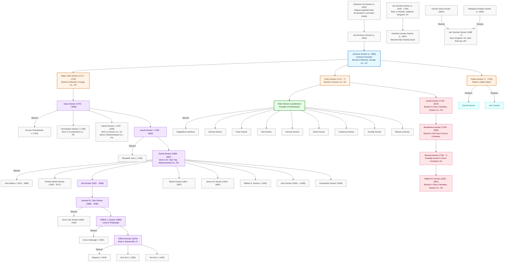

# The Decker Family Legacy: From Holland to America

## A Comprehensive Genealogical and Historical Report

## Table of Contents
- [Executive Summary](#executive-summary)
- [I. European Origins and Early American Settlement](#i-european-origins-and-early-american-settlement)
- [II. The Common Ancestor and Diverging Branches](#ii-the-common-ancestor-and-diverging-branches)
- [III. The Founding and Development of Deckertown](#iii-the-founding-and-development-of-deckertown)
- [IV. The Decker Family in American History](#iv-the-decker-family-in-american-history)
- [V. Geographic Expansion of the Decker Family](#v-geographic-expansion-of-the-decker-family)
- [VI. Family Naming Patterns and Cultural Practices](#vi-family-naming-patterns-and-cultural-practices)
- [VII. Notable Decker Family Members](#vii-notable-decker-family-members)
- [VIII. Conclusion](#viii-conclusion)
- [Family Tree Diagram](#family-tree-diagram)
- [Sources](#sources)

## Executive Summary

This report presents a comprehensive analysis of the Decker family history, drawing from multiple primary sources including Charles E. Stickney's 1895 "History of Deckertown," a detailed family tree diagram, and three genealogical records. Together, these sources trace the Decker family's journey from their origins in Holland through their settlement and expansion across America over nearly four centuries.

The Decker family's American story begins with Johannes De Decker (c. 1620), who helped negotiate New Amsterdam's surrender in 1664, and continues through multiple generations that shaped communities across New York, New Jersey, Pennsylvania, West Virginia, and Florida. This report highlights how the Decker family networks influenced settlement patterns, economic development, and community formation in early America, with particular focus on the founding and growth of Deckertown (now Sussex, New Jersey).

Through careful analysis of multiple sources, this report identifies key family branches, documents significant historical events involving family members, traces geographic movements, and establishes connections between different generations. The result is a comprehensive genealogical and historical account that places the Decker family within the broader context of American history.

## I. European Origins and Early American Settlement

### European Roots

The Decker family's American story begins in Holland. According to genealogical records, the earliest known ancestor was Johannes De Decker (c. 1620), who played a significant role in American colonial history by helping negotiate New Amsterdam's surrender in 1664 when the Dutch colony was taken over by the British.

His son, Jan Gerritse(n) Decker, was born around 1640 in Heerden, Gilderland, Holland (Netherlands) and emigrated to the American colonies. Jan married Grietje Hendrisckse Westercamp on March 23, 1664, in the Kingston (Wiltwyck) Reform Dutch Church in Ulster County, New York. Grietje was born between 1642-1644 in New Amsterdam (later New York).

Jan Gerritse(n) Decker established himself in the Kingston area, appearing on the muster roll of the garrison at Wiltwyck (Kingston) in 1661. In 1663, he and his family faced hardship when they were taken prisoner along with their three children. He appears in Kingston Church records in 1688, 1697, and 1701, attended a trustees meeting in Rochester in 1703, and was listed on the 1709 tax list of Ulster County. He died before February 23, 1709, in Ulster County, NY.

### Second Generation in America

The second generation of Deckers in America included Hendrick Jansen Decker, born around 1667 in Accord (Kingston), Rochester Township, Ulster County, NY. Hendrick married twice: first to Jannetjen Kortright and later to Antje (Hannah) Geertje Quick on December 18, 1696, in the Kingston Reformed Dutch Church. Antje was born between 1668-1674 in Kingston and died around 1717 in Port Jervis, Deerpark, Orange County, NY. Their son Thomas was baptized on September 3, 1704.

Another important second-generation member was Jan Gerritse Decker (b. July 28, 1688, Kingston, Ulster County, NY; d. Romney, Hampshire, WV), whose parents were Gerrett Janse Decker (b. February 14, 1664) and Margariet Grietjen Decker (b. about August 31, 1664). Jan married Barbara Janes DeWitt (b. April 17, 1692). His migration from New York to West Virginia demonstrates the family's early westward movement.

## II. The Common Ancestor and Diverging Branches

The family tree identifies Johannis Decker (c. 1685) as a common ancestor for the various branches of the Decker family in America. Johannis was buried in Minisink, Orange County, NY. From this common ancestor, three main branches of the family emerged:

### Isaac's Line (Moving to Pennsylvania)

One branch of the family, beginning with Major John Decker (1712-1793), eventually migrated to Pennsylvania. This lineage continued through Isaac Decker (1743-~1840), who married Dorcas Chamberlain (~1750-). Isaac appears to be a pivotal figure connecting the New Jersey and Pennsylvania branches. His long life (nearly 100 years) spans from the colonial era through the early republic.

Isaac and Dorcas had several children, including:
- Christopher Decker (~1780-, b. in Cumberland Co., PA)
- Daniel Decker (~1787-1840, b. in Sussex Co., NJ, d. in Fairfield Twp, Westmoreland Co, PA)

The line continued through Jacob Decker (~1784-1835), who married Elizabeth Irwin (~1785-). Jacob may have been Isaac's son, representing the transition of the family from New Jersey to Pennsylvania. Jacob and Elizabeth had a son named Daniel Decker (1808-1887).

Daniel Decker (1808-1887) married Sara Martin (~1813-1885) and had several children, including:
- Charles Martin Decker (1835-1871)
- Job Decker (1837-1899)
- Martin Decker (1841-1887)
- James W. Decker (1843-1865)
- William A. Decker (b. ~1843)
- John Decker (1844-<1900)
- Chamberlin Decker (b. 1846)

Daniel lived and died in St. Clair Township, Westmoreland County, PA, firmly establishing the Decker family in western Pennsylvania.

Job Decker (1837-1899) continued the line, fathering Samuel St. Clair Decker (1865-1930), who married Anna Lide Sharpe (1866-1946). Samuel and Anna had a son named Clifford J. Decker (1896-), who lived in Pittsburgh, PA and married Anna Carbaugh (~1891-).

Clifford J. Decker and Anna had a son named Clifford Decker (1915-), who married Marjorie (~1919-) and had two sons (b. ~1950). Clifford died in Gainesville, FL, representing the family's geographic expansion to Florida in the mid-20th century.

### Peter's Line (Remaining in New Jersey)

The second branch, which is more directly connected to the founding and development of Deckertown, remained in New Jersey. This lineage included:
- Peter Decker (1711-?), buried in Sussex County, NJ (likely Clove Cemetery)
- Peter Decker (Landowner), buried in Sussex County, NJ (likely Old Clove Cemetery)
- Josiah Decker (1740-1814), buried in Clove Cemetery, Sussex County, NJ
- Bowdewine Decker (1763-1853), buried in Old Clove Church Cemetery, Sussex County, NJ
- Samuel Decker (1790-?), possibly buried in Clove Cemetery, NJ
- William B. Decker (1825-1861), buried in Clove Cemetery, Sussex County, NJ
- Chester Edward Decker Sr. (1926-2023), buried in Clove Cemetery, Sussex County, NJ

### Tobias Decker Line (West Virginia Frontier)

Another significant branch was established by Tobias Decker, who died on October 16, 1759, during an Indian attack. Tobias had brothers named Garrett and John Decker. This family settled in Monongalia County, WV in 1758, representing the frontier experience of the Decker family.

Tobias and his brothers were among 11 riflemen with Braddock's Army who lost their way after the Battle of Monongahela during the French-Indian War (1754-55). After the battle, they settled near what is now Morgantown, WV. Tragically, Tobias, his wife, and two children were killed in a 1759 attack by Delaware Indians on the Decker's Creek settlement.

## III. The Founding and Development of Deckertown

### Peter Decker: The Founder

According to Stickney's "History of Deckertown," Peter Decker was the founder of what would become Deckertown. He and his wife Magdalena (née Isterbout) were described as "sturdy American born Hollanders" whose original German names were Petrus and Lecentje Decker. Peter cleared the virgin soil and established the first homestead in what would later become the town center.

The settlement was initially called "Deckerville" after the founding family and began as a small collection of log houses in the wilderness. Peter's sons who settled around him in Deckertown were Samuel, Pope, and Hick, and they had daughters named Hannah, Maria, Catherina, Annetje, and Rebecca.

By 1895, when Stickney wrote his history, approximately eight-tenths of the inhabitants of Deckertown were related by blood or marriage to Peter and Magdalena Decker, demonstrating the profound influence this family had on the community's development.

### Early Settlement Context

The early development of Deckertown was influenced by broader colonial patterns. The Minisink patent of 1702, issued by Queen Anne, conveyed lands from the lower end of Big Minisink Island northeast in New Jersey to certain parties, setting the stage for settlement disputes that would continue for decades.

The settlement's growth was also shaped by its relationship with indigenous peoples, particularly the Munsey Indians (also called Munsies), whose tribal emblem or totem was a wolf that served as their signature and was recognized by other Indian tribes throughout the region.

### Infrastructure and Economic Development

The physical development of Deckertown is chronicled in Stickney's history. Andrew Willson built the first frame house in the neighborhood around the end of the Revolutionary War, followed by Peter Decker building his own frame house around the same time. Early roads were developed, including one that was later straightened in 1817 when the Hoboken and Milford turnpike was constructed.

Economic activities in early Deckertown included the manufacture of potash, with Robert Morris Jr. specifically noted as being involved in this industry in 1772. The presence of a cider house and distillery, mentioned in a foreclosure action, suggests diversification of economic activities as the settlement grew.

### Land Ownership and Property Development

The division of Peter Decker's original land holdings into the many small parcels that later comprised Deckertown is described by Stickney as a process that cannot be followed in detail, but he notes that various speculators suffered losses in their dealings. The text suggests that Peter Decker never received the full reward he deserved for his preemption rights.

The family tree diagram notes several important land transactions involving the Decker family:
- Peter Decker (Landowner) owned land surveyed for Richard Penn
- Peter Decker sold part of Richard Penn land to Joseph Sharp (1813)
- Samuel Decker (1790) sold land to Bowdewine Decker (1790)
- Bowdewine Decker purchased land from Samuel Decker (1790)

A significant foreclosure action resulted in the Sheriff selling the cider house, distillery lots, and several other parcels of land in Deckertown. Bowdewine Decker was the purchaser, as recorded in a deed dated April 9, 1827. Seven or eight years later, Samuel Whittaker, William Rankin, and John Loomis bought large portions of the real estate, followed by Jacob E. Hornbeck, reflecting the changing patterns of land ownership as the town developed.

## IV. The Decker Family in American History

### Revolutionary War Service

The Decker family played a role in the American Revolution, with several family members serving in the Continental Army. The genealogical records mention several Decker family members who served in the Revolutionary War, including Abraham Decker, Benjamin Decker, Conrad Decker, George Decker, Isaac Decker, Jacob Decker, Jacob C. Decker, John Decker, and Lawrence L. Decker.

A letter from Revolutionary War veteran and pensioner George/Joris Decker describes his service, including being marched to the Delaware River on the frontiers in New York, then to North River to Stony Point, and later being drafted for a 9-month tour before the Battle of Long Island.

### French-Indian War and Frontier Conflicts

The Decker family was also involved in the French-Indian War (1754-55). Tobias and Garrett Decker were among 11 riflemen with Braddock's Army who, after the Battle of Monongahela, settled near what is now Morgantown, WV.

The frontier experience of the Decker family is dramatically illustrated by the 1759 attack on the Decker's Creek settlement by Delaware Indians, which resulted in the deaths of Tobias Decker, his wife, and two children, along with other settlers. This tragic event highlights the dangers faced by frontier settlers during this period.

From historical accounts: "On the afternoon of Oct 16, 1759 the settlement was attacked by about 30 Delaware Indians who murdered 8 persons, killed the livestock, burned the cabins and destroyed the crops. They captured Abel Westfall, took him to Fort Duquesne then to an Indian town in Ohio. 39 men & women were away from the settlement at the time. Those killed were Tobias Decker, his wife and two children; William Zern and wife; Abel Westfall's wife and son."

### Boundary Disputes

Boundary disputes between New York and New Jersey significantly affected the region's development. When Sussex County was organized in 1853 after being cut from Morris County, disputes between New York and New Jersey claimants to lands along the boundary line were at their height. New York State had been exercising authority and collecting taxes over lands that would later be included in New Jersey, while New Jersey Proprietors claimed that the boundary line should run from the Hudson River in a straight line to the northernmost branch of the Delaware River, which would have reached Cochecton. This would have placed Port Jervis and surrounding lands within New Jersey, leading to disputes, writs of ejectment, and "lively times along the border."

## V. Geographic Expansion of the Decker Family

The Decker family's geographic movement across America reflects broader patterns of American westward expansion:

### New York to New Jersey/West Virginia
- Early Deckers like Jan Gerritse Decker were born in New York (Kingston, Ulster County)
- Some descendants moved to New Jersey (Sussex County)
- Others like Jan himself and Tobias Decker moved to what is now West Virginia

### New Jersey to Pennsylvania
- Isaac Decker's son Daniel was born in Sussex County, NJ but died in Westmoreland County, PA
- This represents a significant westward migration

### Settlement in Western Pennsylvania
- Multiple generations lived and died in Westmoreland County, PA
- Specific locations include Fairfield Township and St. Clair Township
- The family established deep roots in this region

### Expansion to Florida
- By the mid-20th century, at least one branch (Clifford Decker) had moved to Gainesville, FL
- Represents the continued geographic mobility of the family

## VI. Family Naming Patterns and Cultural Practices

The Decker family exhibits several naming patterns across generations:

### Recurring First Names
- Isaac
- Daniel
- John
- Clifford
- Jacob
- Peter

### Generational Naming
- Clifford J. Decker named his son Clifford
- This pattern of naming sons after fathers appears in multiple instances

### Cemetery Patterns
- Multiple generations of the New Jersey branch are buried in Clove Cemetery
- The Pennsylvania branch has multiple family members buried in St. Clair Township and Laurel Hill Furnace Cemetery
- These burial patterns reflect the family's strong regional ties

## VII. Notable Decker Family Members

### Johannes De Decker (c. 1620)
- Helped negotiate New Amsterdam's surrender in 1664
- Earliest known ancestor of the American Decker family

### Jan Gerritse(n) Decker (c. 1640-1709)
- Born in Heerden, Gilderland, Holland
- Appeared on the muster roll of the garrison at Wiltwyck (Kingston) in 1661
- Taken prisoner with his family in 1663
- Married Grietje Hendrisckse Westercamp on March 23, 1664

### Peter Decker (Founder of Deckertown)
- Described as a "sturdy American born Hollander"
- Original German name was Petrus Decker
- Cleared virgin soil and established the first homestead in what would become Deckertown
- Married Magdalena (née Isterbout)
- Sons included Samuel, Pope, and Hick

### Tobias Decker (d. 1759)
- Settled in Monongalia Co., WV in April 1758
- Veteran of Braddock's Expedition during the French-Indian War
- Killed along with his wife and two children in an Indian attack on October 16, 1759

### Isaac Decker (1743-~1840)
- Lived nearly 100 years, spanning from colonial era through early republic
- Pivotal figure connecting New Jersey and Pennsylvania branches
- Married Dorcas Chamberlain
- Father of Christopher Decker and Daniel Decker

### Daniel Decker (1808-1887)
- Established the family firmly in western Pennsylvania
- Lived and died in St. Clair Township, Westmoreland County, PA
- Married Sara Martin
- Father of Job Decker and six other children

### Samuel St. Clair Decker (1865-1930)
- Married Anna Lide Sharpe (1866-1946)
- Father of Clifford J. Decker
- Buried in Laurel Hill Furnace Cemetery, PA

### Clifford Decker (1915-)
- Represents the family's geographic expansion to Florida
- Son of Clifford J. Decker and Anna Carbaugh
- Died in Gainesville, FL

## VIII. Conclusion

The comprehensive analysis of the Decker family history reveals a family deeply intertwined with the development of early America. From their origins in Holland to their settlement and expansion across New York, New Jersey, Pennsylvania, West Virginia, and beyond, the Deckers exemplify the American immigrant experience and the nation's westward expansion.

The family's involvement in significant historical events—from the surrender of New Amsterdam to the French-Indian War, the Revolutionary War, and frontier conflicts—places them at the center of America's formative experiences. Their founding and development of Deckertown demonstrates how family networks influenced community formation and economic development in early America.

The detailed genealogical information now available provides a comprehensive understanding of the Decker family's branches, movements, and contributions to American history. This integrated history serves as a valuable resource for understanding not just one family's journey, but the broader patterns of settlement, conflict, and community-building that shaped the American experience.

## Family Tree Diagram

## Sources

1. Stickney, Charles E. "History of Deckertown; which includes a history of the Crigar, Titsworth, and Decker families to some extent." Deckertown, N.J., 1895.

2. "Decker-Family Book" (genealogical record), 2025.

3. Decker Family Tree Diagram (provided by user), 2025.

4. "rmominee-fortunecity-ws-wga4-html-i303.pdf" (genealogical record), 2025.

5. "quickening-zapto-org-gramps-ppl-0-3-abfffc499be08b83130-html.pdf" (genealogical record of Jan Gerritse Decker), 2025.

6. "quickening-zapto-org-gramps-ppl-5-3-ba8a150a15067714f35-html.pdf" (genealogical record of Tobias Decker), 2025.

## **Find a Grave Confirmed Burials**
Below are **confirmed burials** from Find a Grave for individuals appearing in the genealogy chart:

- **[Daniel Decker (1808-1887)](https://www.findagrave.com/memorial/57753620/daniel-decker)**  
  - **Burial**: West Fairfield Cemetery, Fairfield Township, Westmoreland County, Pennsylvania, USA

- **[Isaac Decker (1794-1856)](https://www.findagrave.com/memorial/33333214/isaac-decker)**  
  - **Burial**: Laurel Hill Furnace Cemetery, Saint Clair Township, Westmoreland County, Pennsylvania, USA

- **[Isabella Davis Decker (1844-1920)](https://www.findagrave.com/memorial/86567652/isabella-decker)**  
  - **Burial**: Laurel Hill Furnace Cemetery, Saint Clair Township, Westmoreland County, Pennsylvania, USA

- **[Samuel St. Clair Decker (1865-1930)](https://www.findagrave.com/memorial/125481647/samuel-st._clair-decker)**  
  - **Burial**: Laurel Hill Furnace Cemetery, Saint Clair Township, Westmoreland County, Pennsylvania, USA

- **[Anna Lide Sharp Decker (1866-1946)](https://www.findagrave.com/memorial/125481679/anna-lide-decker)**  
  - **Burial**: Laurel Hill Furnace Cemetery, Saint Clair Township, Westmoreland County, Pennsylvania, USA

- **[Harvey Reed Decker (1890-1922)](https://www.findagrave.com/memorial/85048797/harvey-reed-decker)**  
  - **Burial**: Laurel Hill Furnace Cemetery, Saint Clair Township, Westmoreland County, Pennsylvania, USA

- **[Frank Vincent Decker (1909-1941)](https://www.findagrave.com/memorial/125484972/frank-vincent-decker)**  
  - **Burial**: Laurel Hill Furnace Cemetery, Saint Clair Township, Westmoreland County, Pennsylvania, USA

# Decker Family Grave locations - A work in progress

## Laurel Hill Furnace Cemetery (Westmoreland County, PA)

### John Decker Hull (1834-1866)
- **Parents**: 
  - Tobias Sechler Hull Sr (1803-1887)
  - Sarah Decker Hull (1815-1844)
- **Spouse**: Sarah Jane Hair Hull (1839-1860)
- **Siblings**: Tobias Seckler Hull Jr (1825-1892)
- **Children**: George Hull (1860-1860)

### Samuel St. Clair Decker (1865-1930)
- **Occupation**: Wood chopper (per 1900 census)
- **Spouse**: Annie L. (b. Feb 1868)
- **Children**:
  - May M. (b. May 1887)
  - Reed (b. Feb 1890)
  - Zora (b. Dec 1891)
  - Jane (b. Sep 1893)
  - Clifford (b. Nov 1895)
  - Albert (b. Oct 1897)
  - Samuel S. (b. Feb 1900)
- **Census Records**:
  - 1900: Westmoreland Co. St. Clair Twp, dwelling 48, family 50
  - 1910: Westmoreland Co. St. Clair Twp, Laurel Hill Road, dwelling 106, family 117
-  **Additional Photo** 
  - Death Certificate https://www.findagrave.com/memorial/125481647/samuel-st._clair-decker/photo

## Clove Cemetery (Sussex County, NJ)

### William B. Decker (1825-1861)
- **Spouse**: Maria A. Decker (1829-1891)
- **Children**:
  - William R. Decker (1853-1936)
  - John B. Decker Jr (1861-1861)

### Josiah Decker (1740-1814)
- **Family relationships not listed**

### Sarah Decker Decker (1806-1851)
- **Family relationships not listed**

### William R. Decker (1853-1936)
- **Parents**: William B. Decker (1825-1861) and Maria A. Decker (1829-1891)

### Charity M. Kilpatrick Decker (d. 1868)
- **Family relationships not listed**

### Mary Louesa DeWitt Decker (1836-1912)
- **Family relationships not listed**

## Old Clove Church Cemetery (Wantage, NJ)

### Unknown Decker
- **Family relationships not listed**

### William Decker (1776-1851)
- **Family relationships not listed**

## Notes
- This document captures the family relationships as listed on the Find A Grave memorial pages
- Some memorial pages do not list family relationships
- The Decker name appears in multiple family lines, suggesting intermarriage between Decker families
- Sarah Decker Hull is a connection point between the Hull and Decker families

# Updated Decker Family Relationships

## Laurel Hill Furnace Cemetery (Westmoreland County, PA)

### John Decker Hull (1834-1866)
- **Parents**: 
  - Tobias Sechler Hull Sr (1803-1887)
  - Sarah Decker Hull (1815-1844)
- **Spouse**: Sarah Jane Hair Hull (1839-1860)
- **Siblings**: Tobias Seckler Hull Jr (1825-1892)
- **Children**: George Hull (1860-1860)

### Samuel St. Clair Decker (1865-1930)
- **Occupation**: Wood chopper (per 1900 census)
- **Spouse**: Anna Lide Sharp Decker (1866-1946)
  - Born: 22 Feb 1866, New Florence, PA
  - Died: 4 Feb 1946 (aged 79), Shelocta, Indiana County, PA
  - Parents: William T. and Mary Ann (Slick) Sharp
- **Children**:
  - Harvey Reed Decker (1890-1922)
  - May M. (b. May 1887)
  - Lloyd A. (mentioned in Anna's obituary)
  - Samuel S. Jr. (mentioned in Anna's obituary, lived in Pitcairn)
  - Logan H. (mentioned in Anna's obituary, lived in New Florence)
  - A.L. Decker (mentioned in Anna's obituary)
  - Zora Decker Boyer (mentioned in Anna's obituary)
  - Jane Decker (mentioned in Anna's obituary)
- **Census Records**:
  - 1900: Westmoreland Co. St. Clair Twp, dwelling 48, family 50
  - 1910: Westmoreland Co. St. Clair Twp, Laurel Hill Road, dwelling 106, family 117

### Anna Lide Sharp Decker (1866-1946)
- **Birth**: 22 Feb 1866, New Florence, Westmoreland County, PA
- **Death**: 4 Feb 1946 (aged 79), Shelocta, Indiana County, PA
- **Parents**: William T. and Mary Ann (Slick) Sharp
- **Spouse**: Samuel St. Clair Decker (1865-1930)
- **Children**: Six children (as listed under Samuel St. Clair Decker)
- **Other Information**: 
  - Member of the Methodist Church
  - Lived in McKeesport before returning to New Florence
  - Moved to Shelocta seven years before her death
  - Had 16 grandchildren and 6 great-grandchildren at time of death
  - Had a sister named Elizabeth who lived in New York

### Harvey Reed Decker (1890-1922)
- **Birth**: 9 Feb 1890, New Florence, PA
- **Death**: 9 Jul 1922 (aged 32), New Florence, Westmoreland County, PA
- **Parents**: Samuel St. Clair Decker and Anna Lide Sharp Decker (inferred)
- **Spouse**: Tabitha V. McNeilly
  - Born: Jun 1, in Seward
  - Appears on same headstone (1900-1922)
- **Occupation**: Brakeman for R.R. Co.
- **Other Information**:
  - Marriage license #39682 in Westmoreland County
  - Residence at time of marriage: Pitcairn, PA
  - No previous marriages noted

### Frank Vincent Decker (1909-1941)
- **Birth**: 10 Jun 1909, New Florence, Westmoreland County, PA
- **Death**: 29 Jul 1941 (aged 32), Shelocta, Indiana County, PA
- **Occupation**: Teacher at Shelocta Borough School for 8 years
- **Cause of Death**: Heart condition
- **Other Information**:
  - Died at his home, Indiana, R.D. 3
  - Death certificate #65407
  - Relationship to other Deckers not explicitly stated, but likely related to Samuel and Anna Decker family based on locations (New Florence, Shelocta)

## Clove Cemetery (Sussex County, NJ)

### William B. Decker (1825-1861)
- **Spouse**: Maria A. Decker (1829-1891)
- **Children**:
  - William R. Decker (1853-1936)
  - John B. Decker Jr (1861-1861)

### Josiah Decker (1740-1814)
- **Family relationships not listed**

### Sarah Decker Decker (1806-1851)
- **Family relationships not listed**

### William R. Decker (1853-1936)
- **Parents**: William B. Decker (1825-1861) and Maria A. Decker (1829-1891)

### Charity M. Kilpatrick Decker (d. 1868)
- **Family relationships not listed**

### Mary Louesa DeWitt Decker (1836-1912)
- **Family relationships not listed**

## Old Clove Church Cemetery (Wantage, NJ)

### Unknown Decker
- **Family relationships not listed**

### William Decker (1776-1851)
- **Family relationships not listed**

## Notes
- This updated document includes the three previously missed Decker graves at Laurel Hill Furnace Cemetery
- Anna Lide Sharp Decker was Samuel St. Clair Decker's wife, previously only identified as "Annie L."
- Harvey Reed Decker was Samuel and Anna's son, previously only identified as "Reed"
- Frank Vincent Decker's exact relationship to the other Deckers is not explicitly stated in his memorial, but the locations (New Florence, Shelocta) suggest he may be related to the Samuel and Anna Decker family
- Based on Anna's obituary, we now have names for all of Samuel and Anna's six surviving children as of 1946
- The Decker name appears in multiple family lines, suggesting intermarriage between Decker families
- Sarah Decker Hull is a connection point between the Hull and Decker families
