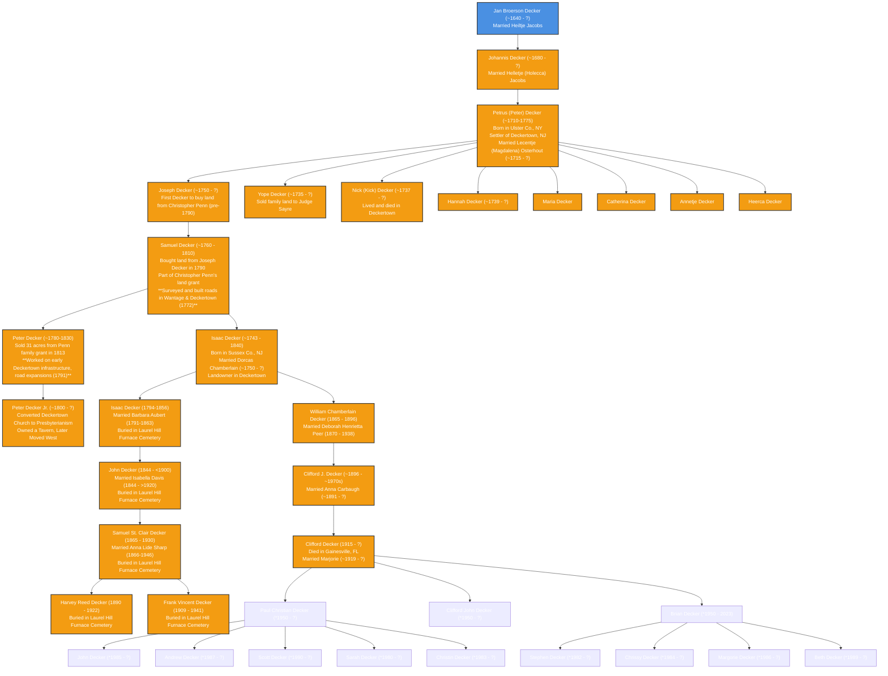

# Decker Family Genealogy

## Overview
This document provides a comprehensive genealogy of the Decker family, tracing its roots from **John de Decker**, a Dutch statesman, to **Peter Decker (~1710-1775)**, the founder of Deckertown (now Sussex Borough, NJ), and through subsequent generations. This includes land records, historical migrations, and significant family members.

## **Origins of the Decker Family**
The Decker family traces its roots back to **John de Decker**, a Dutch statesman who served as a **Counselor of State under Governor Peter Stuyvesant** during the Dutch colonial period. He was instrumental in **negotiating the surrender of New Amsterdam to the English in 1664**, which led to the establishment of British rule in what later became **New York**. After this transition, many Dutch families, including the Deckers, moved inland to areas such as **Esopus (now Kingston, NY)** and later to **Minisink and Deckertown (now Sussex, NJ)**.

The first confirmed settler in the Decker family line in Deckertown was **Peter Decker (~1710-1775)**, whose descendants played a significant role in the development of **Sussex County, NJ, and later migrated to Pennsylvania and beyond**.

## **Mermaid.js Genealogy Chart**

## **Find a Grave Confirmed Burials**
Below are **confirmed burials** from Find a Grave for individuals appearing in the genealogy chart:

- **[Daniel Decker (1808-1887)](https://www.findagrave.com/memorial/57753620/daniel-decker)**  
  - **Burial**: West Fairfield Cemetery, Fairfield Township, Westmoreland County, Pennsylvania, USA

- **[Isaac Decker (1794-1856)](https://www.findagrave.com/memorial/33333214/isaac-decker)**  
  - **Burial**: Laurel Hill Furnace Cemetery, Saint Clair Township, Westmoreland County, Pennsylvania, USA

- **[Isabella Davis Decker (1844-1920)](https://www.findagrave.com/memorial/86567652/isabella-decker)**  
  - **Burial**: Laurel Hill Furnace Cemetery, Saint Clair Township, Westmoreland County, Pennsylvania, USA

- **[Samuel St. Clair Decker (1865-1930)](https://www.findagrave.com/memorial/125481647/samuel-st._clair-decker)**  
  - **Burial**: Laurel Hill Furnace Cemetery, Saint Clair Township, Westmoreland County, Pennsylvania, USA

- **[Anna Lide Sharp Decker (1866-1946)](https://www.findagrave.com/memorial/125481679/anna-lide-decker)**  
  - **Burial**: Laurel Hill Furnace Cemetery, Saint Clair Township, Westmoreland County, Pennsylvania, USA

- **[Harvey Reed Decker (1890-1922)](https://www.findagrave.com/memorial/85048797/harvey-reed-decker)**  
  - **Burial**: Laurel Hill Furnace Cemetery, Saint Clair Township, Westmoreland County, Pennsylvania, USA

- **[Frank Vincent Decker (1909-1941)](https://www.findagrave.com/memorial/125484972/frank-vincent-decker)**  
  - **Burial**: Laurel Hill Furnace Cemetery, Saint Clair Township, Westmoreland County, Pennsylvania, USA

