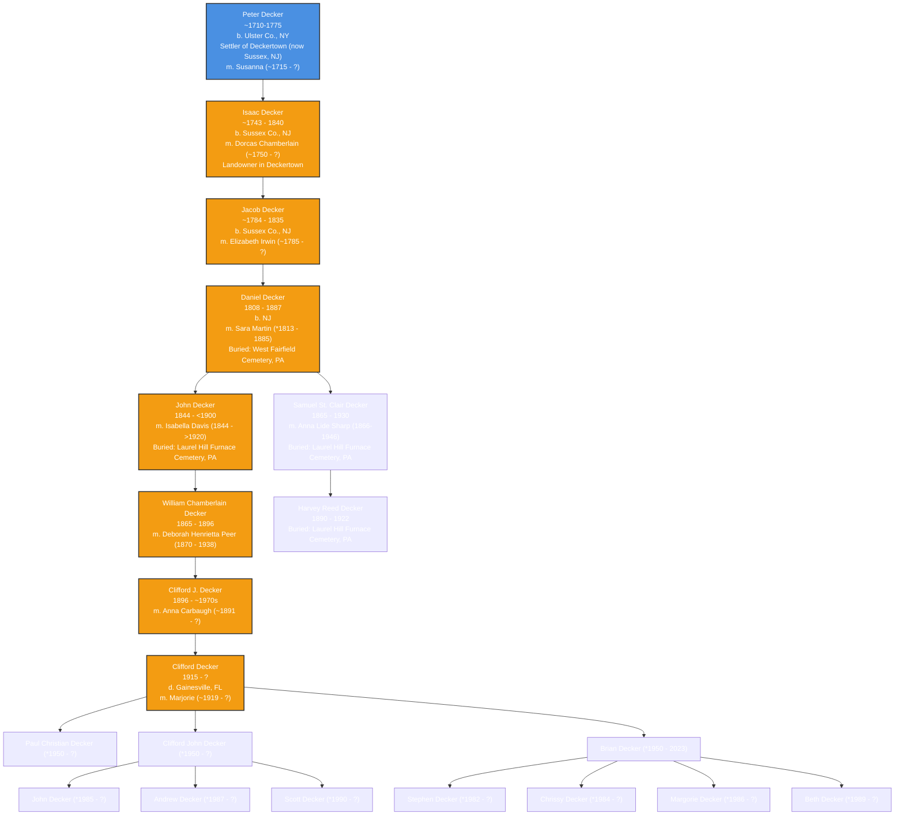

# Decker Family Genealogy

## Overview
This document provides a comprehensive genealogy of the Decker family, tracing its roots from **John de Decker**, a Dutch statesman, to **Peter Decker (~1710-1775)**, the founder of Deckertown (now Sussex Borough, NJ), and through subsequent generations. This includes land records, historical migrations, and significant family members.

## **Origins of the Decker Family**
The Decker family traces its roots back to **John de Decker**, a Dutch statesman who served as a **Counselor of State under Governor Peter Stuyvesant** during the Dutch colonial period. He was instrumental in **negotiating the surrender of New Amsterdam to the English in 1664**, which led to the establishment of British rule in what later became **New York**. After this transition, many Dutch families, including the Deckers, moved inland to areas such as **Esopus (now Kingston, NY)** and later to **Minisink and Deckertown (now Sussex, NJ)**.

The first confirmed settler in the Decker family line in Deckertown was **Peter Decker (~1710-1775)**, whose descendants played a significant role in the development of **Sussex County, NJ, and later migrated to Pennsylvania and beyond**.

## **Mermaid.js Genealogy Chart**

##Find a Grave Confirmed Burials

Below are confirmed burials from Find a Grave for individuals appearing in the genealogy chart:
	•	Daniel Decker (1808-1887)
	•	Burial: West Fairfield Cemetery, Fairfield Township, Westmoreland County, Pennsylvania, USA
	•	Isabella Davis Decker (1844-1920)
	•	Burial: Laurel Hill Furnace Cemetery, Saint Clair Township, Westmoreland County, Pennsylvania, USA
	•	Samuel St. Clair Decker (1865-1930)
	•	Burial: Laurel Hill Furnace Cemetery, Saint Clair Township, Westmoreland County, Pennsylvania, USA
	•	Anna Lide Sharp Decker (1866-1946)
	•	Burial: Laurel Hill Furnace Cemetery, Saint Clair Township, Westmoreland County, Pennsylvania, USA
	•	Harvey Reed Decker (1890-1922)
	•	Burial: Laurel Hill Furnace Cemetery, Saint Clair Township, Westmoreland County, Pennsylvania, USA
