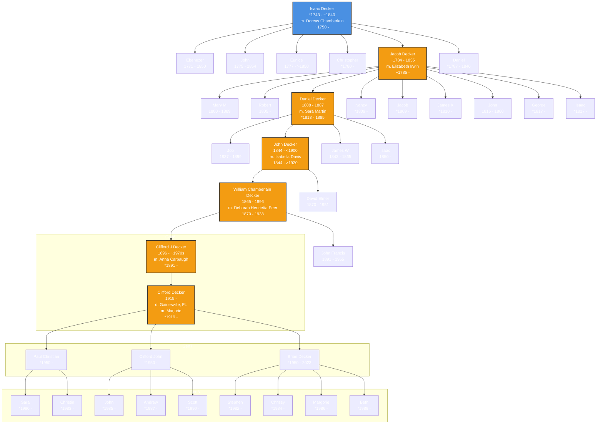

# Decker Family Genealogy

This repository contains a genealogical flowchart tracing the Decker family line from Isaac Decker (*1743 - ~1840) to Clifford Decker (1915 - , died in Gainesville, FL), including all known siblings and children along the direct lineage. The chart is generated using [Mermaid.js](https://mermaid-js.github.io/), which GitHub supports natively in Markdown. Data is sourced from the "webGED: DECKER FAMILIES Data Page" and supplemented by web searches, including obituary records.

## Family Line Flowchart

Below is the flowchart showing the descent from Isaac Decker to Clifford Decker. The direct line is highlighted with a thicker border and light purple fill. Each node includes the individual's name, birth/death years, and spouse (for the direct line). Siblings and children are included as branches off their parents. Additional findings, such as Brian Decker (1957 - ), are integrated from external sources.

## Legend
- **Blue Nodes**: Root ancestor(s)
- **Orange Nodes**: Direct lineage
- **Regular Nodes**: Other family members

### Notes
- Birth and death years are approximate where indicated with `*` or `~`.
- Direct ancestors in the primary lineage are highlighted for clarity.

This visualization makes it easy to see connections between generations and identify key family members. Let me know if you need any modifications!
