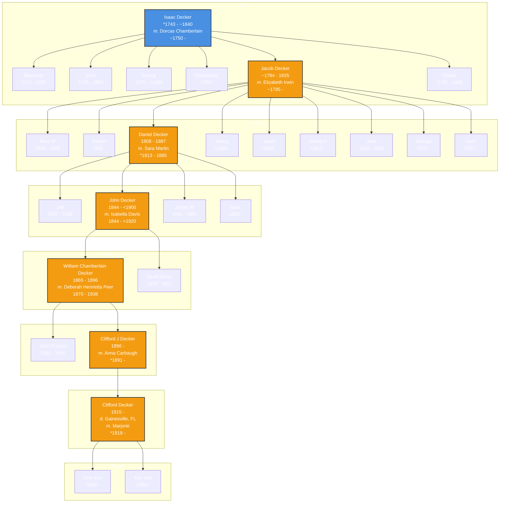

This is a generational family tree for the Decker lineage, visualized using Mermaid.js.

## Family Tree Visualization

## Legend
- **Blue Nodes**: Root ancestor(s)
- **Orange Nodes**: Direct lineage
- **Regular Nodes**: Other family members

### Notes
- Birth and death years are approximate where indicated with `*` or `~`.
- Direct ancestors in the primary lineage are highlighted for clarity.

This visualization makes it easy to see connections between generations and identify key family members. Let me know if you need any modifications!
